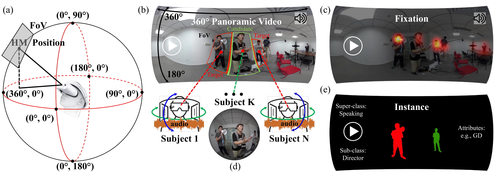

# ASOD60K: Audio-Induced Salient Object Detection in Panoramic Videos

Authors: [*Yi Zhang*], [*Fang-Yi Chao*], [*Ge-Peng Ji*](https://scholar.google.com/citations?user=oaxKYKUAAAAJ&hl=en), [*Deng-Ping Fan*](https://dpfan.net/), [*Lu Zhang*], [*Ling Shao*](https://scholar.google.com/citations?user=z84rLjoAAAAJ&hl=en).

*Fig.Teaser: Annotation examples from the proposed ASOD60K dataset. (a) Illustration of head movement (HM). The subjects wear Head-Mounted Displays (HMDs) and observe 360° scenes by moving their head to control a field-of-view (FoV) in the range of 360°×180°. (b) Each subject (i.e., Subject 1 to Subject N) watches the video without restriction. (c) The HMD-embedded eye tracker records their eye fixations. (d) According to the fixations, we provide coarse-to-fine annotations for each FoV including (e) super/sub-classes, instance-level masks and attributes (e.g., GD-Geometrical Distortion).*

# Introduction

Exploring to what humans pay attention in dynamic panoramic scenes is useful for many fundamental applications, including augmented reality (AR) in retail, AR-powered recruitment, and visual language navigation. With this goal in mind, we propose PV-SOD, a new task that aims to segment salient objects from panoramic videos. In contrast to existing fixation-level or object-level saliency detection tasks, we focus on multi-modal salient object detection (SOD), which mimics human attention mechanism by segmenting salient objects with the guidance of audio-visual cues. To support this task, we collect the first large-scale dataset, named ASOD60K, which contains 4K-resolution video frames annotated with a six-level hierarchy, thus distinguishing itself with richness, diversity and quality. Specifically, each sequence is marked with both its super-/sub-class, with objects of each sub-class being further annotated with human eye fixations, bounding boxes, object-/instance-level masks, and associated attributes (e.g., geometrical distortion). These coarse-to-fine annotations enable detailed analysis for PV-SOD modeling, e.g., determining the major challenges for existing SOD models, and predicting scanpaths to study the long-term eye fixation behaviors of humans. We systematically benchmark 11 representative approaches on ASOD60K and derive several interesting findings. We hope this study could serve as a good starting point for advancing SOD research towards panoramic videos. 

# More details

:running: :running: :running: ***KEEP UPDATING***.   
  

# Citation

@article{zhang2021asod60k,
  title={ASOD60K: Audio-Induced Salient Object Detection in Panoramic Videos},
  author={Zhang, Yi and Chao, Fang-Yi and Ji, Ge-Peng and Fan, Deng-Ping and Zhang, Lu and Shao, Ling},
  journal={arXiv preprint},
  year={2021}
}
